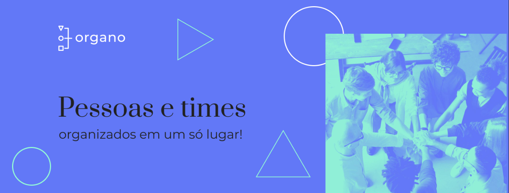
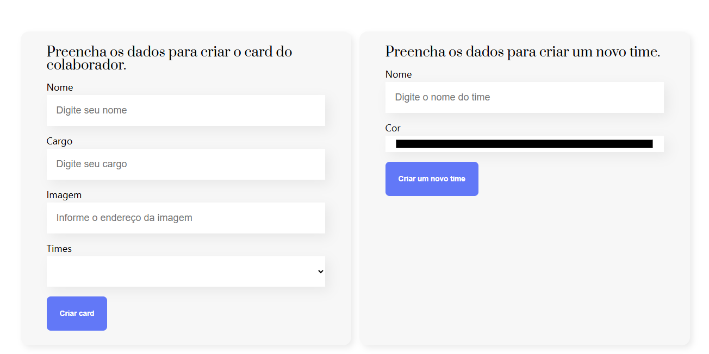
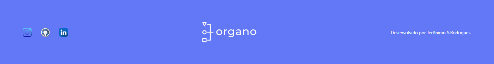

# Projeto React Componentes

## Objetivo Principal
Projeto consiste em um site responsivo onde o usuário pode preencher um formulario com algumas informações por exemplo: nome, cargo, escolher uma imagem e definir o time para criar um card de colaborador.

Também o usuário pode criar um novo formulario para dicionar um novo time escolhendo o nome e a cor.

## Tecnologias Utilizadas
- React
- Vercel
- React-icons
- Git
- Node.js

## Imagens do Projeto

